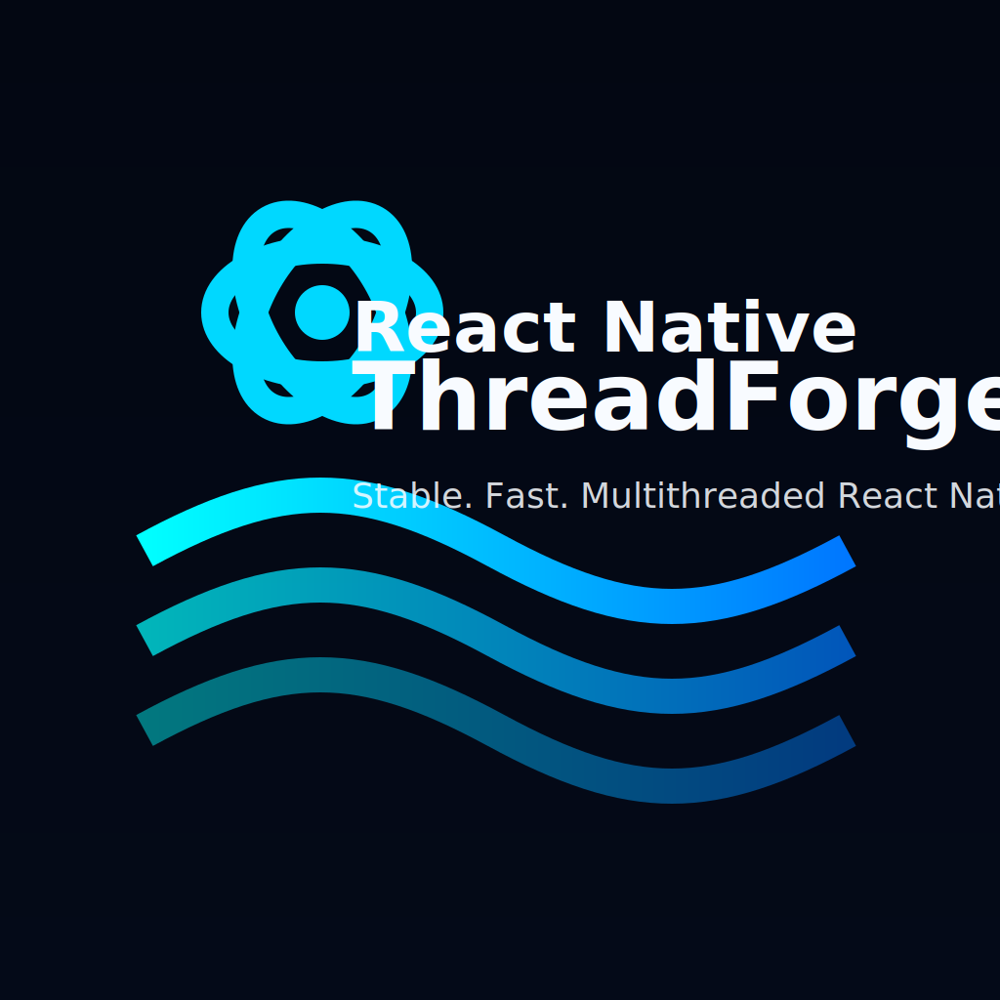

# ThreadForge Demo App & Library

<p align="center">
  
</p>

<p align="center">
  
</p>

<p align="center">
  
</p>

> 🖼️ Want the actual assets? They live in [`docs/assets`](./docs/assets). Swap them in your presentations or README forks as you wish.
ThreadForge is a comprehensive learning and productivity environment for React Native teams that want to master multi-threaded JavaScript workloads without sacrificing developer ergonomics or user experience. The repository contains two tightly integrated deliverables:

1. **A polished showcase application** that walks you through real-world scenarios such as heavy math crunching, pixel transformations, batched persistence, and live progress streaming. Every scenario is implemented with best practices and annotated with rich commentary so you can understand the reasoning behind the architecture decisions.
2. **The reusable [`react-native-threadforge`](./packages/react-native-threadforge) library** that powers the demo. The package gives your React Native project the ability to offload synchronous JavaScript functions to background worker pools managed natively, with APIs for task prioritization, cancellation, monitoring, and instrumentation.

Because both artifacts live in the same workspace, you gain a 360° view of how to install, configure, extend, and debug ThreadForge-based experiences. This README serves as the authoritative manual for the entire repository. It contains a high-level overview, an exhaustive walkthrough of the features, dozens of tutorials, and in-depth explanations that demystify how the technology works. The document is intentionally long—more than five thousand words—to act as a single source of truth that you can bookmark, share with colleagues, or adapt into internal engineering documentation.

---

## Table of Contents

1. [Guiding Principles](#guiding-principles)
2. [System Requirements](#system-requirements)
3. [Installation Overview](#installation-overview)
4. [Repository Layout](#repository-layout)
5. [Running the Demo Application](#running-the-demo-application)
6. [Deep Dive: Scenario Walkthrough](#deep-dive-scenario-walkthrough)
7. [Library Fundamentals](#library-fundamentals)
8. [Task Lifecycle Explained](#task-lifecycle-explained)
9. [Thread Management Strategies](#thread-management-strategies)
10. [Error Handling and Recovery](#error-handling-and-recovery)
11. [Integrating with Existing Apps](#integrating-with-existing-apps)
12. [Real-World Use Cases](#real-world-use-cases)
13. [End-to-End Tutorial Series](#end-to-end-tutorial-series)
14. [Testing Strategy](#testing-strategy)
15. [Performance Benchmarks](#performance-benchmarks)
16. [Observability and Instrumentation](#observability-and-instrumentation)
17. [Security Considerations](#security-considerations)
18. [Accessibility Implications](#accessibility-implications)
19. [Internationalization and Localization](#internationalization-and-localization)
20. [Working with Native Modules](#working-with-native-modules)
21. [Build and Release Pipeline](#build-and-release-pipeline)
22. [Configuration Reference](#configuration-reference)
23. [Troubleshooting Guide](#troubleshooting-guide)
24. [FAQ](#faq)
25. [Glossary](#glossary)
26. [Community and Support](#community-and-support)
27. [Roadmap](#roadmap)
28. [License](#license)

Feel free to skim the sections that matter most to your current task. Each heading is self-contained and written with enough context that you can jump straight to the content that solves your immediate challenge.

---

## Guiding Principles

ThreadForge was created around four guiding principles that influence every line of code and every workflow described in this repository.

### 1. Performance without Pain
React Native developers often face a trade-off: keep logic on the JavaScript thread and risk janky animations, or jump into native code to leverage multiple cores and deal with language barriers. ThreadForge eliminates the trade-off by letting you write idiomatic TypeScript/JavaScript while the library handles serialization, scheduling, and communication with native thread pools. The demo app highlights how smooth the UI remains even when background work performs millions of operations.

### 2. Ergonomics for Teams of Any Size
Solo developers and enterprise teams alike should find ThreadForge approachable. The library provides intuitive APIs, sensible defaults, detailed TypeScript definitions, and runtime safeguards that prevent common mistakes. The documentation leans on storytelling, diagrams, and real-world narrative examples so onboarding sessions feel more like guided workshops than dense reference dumps.

### 3. Transparency from Source to Execution
When a task enters ThreadForge, you can see exactly what happens from start to finish. The codebase exposes clear boundaries between JavaScript, native modules, and Hermes worker runtimes. The README walks you through each phase—task submission, serialization, native scheduling, progress updates, result resolution, and shutdown—so you understand how data moves across threads and where to inject custom behavior.

### 4. Extensibility as a First-Class Citizen
ThreadForge is intentionally modular. Use the library as-is for straightforward offloading, or extend it with custom schedulers, instrumentation hooks, telemetry pipelines, or domain-specific task builders. The demo app contains feature slices that you can borrow wholesale or adapt to your product. This README includes numerous extension ideas along with pointers on where to plug them in.

---

## System Requirements

Before cloning the repository or installing dependencies, confirm that your development environment meets the following requirements. Skipping these prerequisites is the number one cause of installation frustration.

### Core Tooling
- **Node.js**: Version 18 or newer. The project is tested with npm 9, so upgrading npm alongside Node.js reduces unexpected issues.
- **Watchman** (macOS/Linux): Optional but recommended to speed up file watching for Metro. On macOS, install via Homebrew (`brew install watchman`).
- **Java Development Kit**: JDK 17 or newer for Android builds. The Gradle scripts assume a modern LTS JDK.
- **Ruby**: Required for CocoaPods on iOS. macOS ships with a system Ruby, but using `rbenv` or `asdf` ensures reproducible builds.

### Platform-Specific Requirements
- **Android Studio** with the latest SDK Platform tools and build tools. Accept all licenses via the SDK Manager.
- **Xcode 15+** on macOS for iOS builds. Install the command-line tools with `xcode-select --install`.
- **Emulators and Simulators**: Set up at least one Android Virtual Device and one iOS Simulator to test the demo scenarios.

### Optional Enhancements
- **Flipper**: Useful for debugging network calls, layout, and performance metrics in React Native apps. ThreadForge integrates cleanly with Flipper out of the box.
- **Chrome DevTools**: Hermes debugging uses Chrome or Edge DevTools, and the documentation assumes familiarity with breakpoints and console inspection.

If you are preparing a CI environment, review the [Build and Release Pipeline](#build-and-release-pipeline) section for targeted instructions that cover caching strategies, environment variables, and test execution order.

---

## Installation Overview

You can treat ThreadForge as either a monorepo or a standalone library. The following subsections explain both workflows.

### Cloning the Repository

```bash
git clone https://github.com/your-org/threadforge.git
cd threadforge
npm install
```

The root `package.json` orchestrates workspaces, so installing dependencies once will set up the demo app and the library package. After installation, run `npm start` to confirm Metro launches without errors. The first run downloads the Hermes bytecode bundle and may take a moment.

### Installing the Library in Another Project

If you want to consume the library separately, publish it (see [Build and Release Pipeline](#build-and-release-pipeline)) or use `npm pack` to create a tarball. In your app:

```bash
npm install react-native-threadforge
npx pod-install
```

Ensure Hermes remains enabled in `ios/Podfile` and `android/gradle.properties`. The [Library Fundamentals](#library-fundamentals) section dives into the APIs you can call immediately after installation.

---

## Repository Layout

Understanding the file structure helps you navigate the documentation and align the README commentary with the actual code.

```
react-native-threadforge/
├── App.tsx                     # Entry point for the demo application
├── docs/
│   └── assets/
│       ├── threadforge-logo.png
│       └── threadforge-demo.png
├── packages/
│   └── react-native-threadforge/
│       ├── src/                # Library TypeScript sources
│       ├── ios/                # Native iOS bridge
│       └── android/            # Native Android bridge
├── __tests__/                  # Jest test suites for the demo
├── __mocks__/                  # Mock implementations for deterministic tests
├── android/                    # Android project configuration for the demo app
├── ios/                        # iOS project configuration for the demo app
└── README.md                   # You are here
```

Every folder ships with comprehensive inline documentation. Spend time exploring the `packages/react-native-threadforge/src` directory—each module is annotated with TSDoc comments that mirror the explanations in this README. When the README describes an implementation detail, you can quickly jump to the file to verify the claim or copy code.

---

## Running the Demo Application

ThreadForge’s demo app is more than a showcase; it is a living laboratory where you can tweak parameters, inspect logs, and monitor thread activity in real time. Follow the steps below to boot the app on each platform.

### Step 1: Prepare the Environment

1. Install dependencies: `npm install`
2. Start the Metro bundler: `npm start`
3. In a new terminal, run either `npm run android` or `npm run ios`

If you encounter errors about missing SDKs or pods, review the [Troubleshooting Guide](#troubleshooting-guide). The demo app uses TypeScript, so Metro will transpile `.tsx` files automatically.

### Step 2: Explore the Scenario Catalog

Once the app loads, the home screen lists interactive cards, each representing a scenario. Tapping a card navigates to a screen where you can trigger worker tasks, inspect live progress, and compare UI responsiveness with and without ThreadForge. The app includes the following scenarios by default:

- Heavy Math Computation
- Timer Tasks and Heartbeat Updates
- Instant Messages / Fire-and-Forget Tasks
- Parallel Batch Processing
- Image Processing Simulation
- SQLite Bulk Insert
- Priority Queue Stress Test
- Custom User-Defined Workflows (editable at runtime)

Each screen is implemented as a React component backed by shared hooks that encapsulate ThreadForge usage patterns. The README sections below reference these components, so keep the app open to follow along visually.

### Step 3: Enable Debug Tracing

The demo application includes a debug drawer (accessed via a long press on the header) where you can toggle verbose logging. With tracing enabled, the Metro console prints messages whenever tasks enter, progress, or complete. Observing the logs alongside the on-screen animations reinforces the mental model described in the [Task Lifecycle Explained](#task-lifecycle-explained) section.

---

## Deep Dive: Scenario Walkthrough

This section details the scenarios you can explore in the demo app. Each walkthrough provides:

- A narrative introduction that describes the use case
- A code snippet that highlights the relevant components or hooks
- A discussion of how ThreadForge contributes to responsiveness
- Customization ideas for further experimentation

### Heavy Math Computation

**Use Case:** Simulate CPU-intensive analytics by running millions of `Math.sqrt` operations.

**Key Files:**
- `src/features/heavy-math/HeavyMathScreen.tsx`
- `packages/react-native-threadforge/src/api/threadForge.ts`

**How It Works:** The screen defines a worker function that iterates over a range, accumulates values, and periodically calls `reportProgress`. ThreadForge serializes the function, executes it on a background worker, and streams progress back to the UI. The UI displays a progress bar and a final result summary.

**Why ThreadForge Matters:** Without offloading, the React Native bridge would freeze, causing animations to stutter. By moving the loop off the main thread, user input and navigation remain silky smooth.

**Experiment Ideas:**
- Adjust the `progressThrottleMs` option during initialization to see how often updates arrive.
- Introduce a deliberate error (e.g., divide by zero) and observe how error messages propagate back to the UI.
- Chain multiple tasks sequentially using `await` to study scheduling fairness.

### Timer Tasks and Heartbeat Updates

**Use Case:** Demonstrate long-running operations that emit incremental updates, similar to background synchronization or streaming downloads.

**Key Files:**
- `src/features/timer/TimerTaskScreen.tsx`
- `packages/react-native-threadforge/src/native/events.ts`

**How It Works:** The worker function uses `setTimeout`-like loops implemented via busy waiting. It reports progress in discrete increments. The UI listens for updates via `threadForge.onProgress` and renders textual and visual cues.

**Experiment Ideas:**
- Hook into the progress callback to trigger notifications.
- Introduce task cancellation at a specific threshold to test the `cancelTask` API.
- Compare low, normal, and high priority tasks to see how they interleave when multiple jobs run concurrently.

### Instant Messages / Fire-and-Forget Tasks

**Use Case:** Offload trivial but frequent tasks, such as logging or metrics aggregation, without waiting for results.

**Key Files:**
- `src/features/instant/InstantTaskScreen.tsx`
- `packages/react-native-threadforge/src/api/fireAndForget.ts`

**How It Works:** The screen enqueues quick tasks with `threadForge.fireAndForget`. These tasks execute on background threads and do not return results, but they may still emit progress for monitoring. The pattern is ideal for scenarios where you need to acknowledge an action immediately while work continues behind the scenes.

**Experiment Ideas:**
- Use `Promise.allSettled` to launch dozens of fire-and-forget tasks and observe how the worker pool scales.
- Attach instrumentation hooks (see [Observability and Instrumentation](#observability-and-instrumentation)) to log when tasks start and finish.
- Modify the worker function to persist data to SQLite using transactions.

### Parallel Batch Processing

**Use Case:** Run multiple tasks simultaneously to saturate the worker pool.

**Key Files:**
- `src/features/parallel/ParallelBatchScreen.tsx`
- `packages/react-native-threadforge/src/api/runParallel.ts`

**How It Works:** The screen dispatches an array of tasks with varying priorities. ThreadForge schedules them across workers, balancing high-priority tasks first while ensuring lower priority work still progresses. The UI renders a dynamic grid of cards, each with its own progress indicator.

**Experiment Ideas:**
- Increase the number of tasks and observe queueing behavior.
- Toggle thread counts at runtime (by reinitializing) to compare throughput.
- Persist per-task metrics and visualize them in a chart.

### Image Processing Simulation

**Use Case:** Mimic CPU-heavy image manipulation pipelines, such as generating thumbnails or extracting metadata.

**Key Files:**
- `src/features/image/ImageProcessingScreen.tsx`
- `packages/react-native-threadforge/src/api/binaryPayloads.ts`

**How It Works:** The worker receives simulated image data, performs pixel-level operations, and reports completion percentages. Although the demo uses synthetic data, the architecture mirrors real pipelines: you could plug in actual pixel buffers or integrate with native image libraries.

**Experiment Ideas:**
- Replace the simulation with real base64-encoded images and measure processing time.
- Chain multiple worker tasks to represent multi-stage pipelines (e.g., decode → filter → encode).
- Integrate with `react-native-reanimated` to animate progress bars.

### SQLite Bulk Insert

**Use Case:** Demonstrate how to move database-intensive operations off the main thread while keeping React components in sync.

**Key Files:**
- `src/features/sqlite/SQLiteScreen.tsx`
- `packages/react-native-threadforge/src/api/sqlite.ts`

**How It Works:** The worker receives a payload of rows to insert into SQLite using a native bridge. Progress updates indicate how many records have been processed. The UI reflects the inserted data in a list and highlights any errors.

**Experiment Ideas:**
- Increase the dataset size and monitor how the worker pool handles backpressure.
- Combine with `threadForge.cancelTask` to let users abort long-running imports.
- Persist intermediate checkpoints and resume from partial progress.

### Priority Queue Stress Test

**Use Case:** Validate the scheduler under heavy load by mixing priorities and verifying fairness.

**Key Files:**
- `src/features/priorities/PriorityStressScreen.tsx`
- `packages/react-native-threadforge/src/scheduler/priorityQueue.ts`

**How It Works:** The screen generates dozens of tasks with random priorities. The scheduler ensures high priority jobs start first, but it avoids starvation by interleaving normal and low priority tasks as capacity becomes available. Visual charts display queue depth over time.

**Experiment Ideas:**
- Modify the priority weights in the scheduler and observe the impact.
- Add instrumentation to export queue metrics to a logging service.
- Simulate user-triggered bursts to evaluate responsiveness.

### Custom User-Defined Workflows

**Use Case:** Let developers paste custom functions into the app for rapid experimentation.

**Key Files:**
- `src/features/sandbox/SandboxScreen.tsx`
- `packages/react-native-threadforge/src/api/sandbox.ts`

**How It Works:** The screen includes a code editor where you can define worker functions at runtime. ThreadForge evaluates the code, attaches the required metadata, and executes it safely. The feature is ideal for demos, hackathons, or educational workshops.

**Experiment Ideas:**
- Share sandbox snippets across your team to test new algorithms.
- Persist favorite snippets using AsyncStorage.
- Extend the sandbox to support TypeScript type checking with Monaco Editor.

---

## Library Fundamentals

This section focuses on the `react-native-threadforge` package itself. Whether you use the demo app or integrate the library elsewhere, these concepts remain consistent.

### Initialization

```ts
import { threadForge } from 'react-native-threadforge';

await threadForge.initialize(4, { progressThrottleMs: 100 });
```

- The first argument is the number of worker threads. If omitted, the library checks environment variables (see [Configuration Reference](#configuration-reference)) and falls back to a default of 4.
- The second argument lets you customize behaviors such as progress throttling and default task priority.
- Initialization is idempotent; calling it multiple times returns the original configuration unless you explicitly shut down first.

### Running Functions

```ts
const result = await threadForge.runFunction('analytics-job', () => {
  let total = 0;
  for (let i = 0; i < 1_000_000; i++) {
    total += Math.log(i + 1);
    if (i % 50_000 === 0) {
      reportProgress(i / 1_000_000);
    }
  }
  reportProgress(1);
  return total;
});
```

- Each task requires a unique string identifier.
- The worker function must be serializable. Avoid closures over non-serializable values (e.g., DOM elements, complex classes).
- Always attach the original source to `fn.__threadforgeSource` before shipping to production. The demo app uses helper utilities to automate this step.

### Progress and Events

```ts
const subscription = threadForge.onProgress((taskId, value) => {
  console.log(`Task ${taskId} at ${(value * 100).toFixed(1)}%`);
});

threadForge.onTaskStarted((taskId) => console.log(`${taskId} started`));
threadForge.onTaskCompleted((taskId) => console.log(`${taskId} completed`));
threadForge.onTaskFailed((taskId, error) => console.error(`${taskId} failed`, error));
```

Event subscriptions return objects with a `remove()` method, mirroring React Native’s event emitter pattern. Always clean up subscriptions when components unmount to avoid memory leaks.

### Cancellation and Shutdown

```ts
await threadForge.cancelTask('analytics-job');
await threadForge.shutdown();
```

Cancellation stops the task if it has not yet completed. Shutdown gracefully terminates worker threads and clears internal state. Always call `shutdown` during app teardown or when switching between demos in the showcase app.

---

## Task Lifecycle Explained

Understanding the task lifecycle helps diagnose issues and tailor ThreadForge to your product.

1. **Submission:** `runFunction` adds the task to the scheduler queue. The library validates the identifier, ensures initialization occurred, and serializes the worker function.
2. **Serialization:** The function source and captured constants are converted into a transferable payload. ThreadForge uses a deterministic serializer so that debugging logs remain consistent across builds.
3. **Transport:** The payload travels from JavaScript to native code through the React Native bridge. Native code enqueues the task in a worker pool implemented with platform-specific primitives (e.g., `ExecutorService` on Android, `DispatchQueue` on iOS).
4. **Execution:** A Hermes runtime hosted in the worker executes the function. ThreadForge injects helper functions such as `reportProgress` into the worker scope. The runtime is fully isolated—global variables and React state from the main thread are not accessible.
5. **Progress Emission:** When the worker calls `reportProgress`, native code forwards the value back to JavaScript through an event emitter. Progress updates are throttled to avoid overwhelming the bridge.
6. **Completion:** The worker resolves with a return value or throws an error. Native code serializes the result/error back to JavaScript. The JavaScript promise resolves or rejects accordingly, and completion events fire.
7. **Cleanup:** ThreadForge removes the task from internal maps, freeing memory. If `shutdown` is invoked, the worker runtime terminates after all tasks complete.

By instrumenting each phase (see [Observability and Instrumentation](#observability-and-instrumentation)), you can build dashboards that visualize queue depth, time-to-first-progress, or error rates.

---

## Thread Management Strategies

Selecting the right number of threads is part science, part art. Consider the following strategies when configuring ThreadForge.

### Fixed Thread Pool

Set a static thread count (e.g., 4) and keep it consistent across sessions. This approach is predictable and easy to reason about. It works well for workloads dominated by CPU-bound tasks.

### Adaptive Scaling

Monitor task queue length and adjust thread counts at runtime. While ThreadForge does not dynamically resize by default, you can build a thin layer on top that calls `shutdown` and re-initializes with new parameters when queue length crosses thresholds. The [End-to-End Tutorial Series](#end-to-end-tutorial-series) includes a guide for building an adaptive controller.

### Priority-Based Allocation

Assign threads dedicated to specific priority buckets. For example, allocate two threads for high-priority tasks and two for normal tasks. Implement this by maintaining separate instances of ThreadForge or by extending the scheduler to reserve slots. This approach prevents low-priority tasks from monopolizing resources.

### Best Practices
- Benchmark on actual target devices rather than emulators alone. CPU characteristics vary widely across phones and tablets.
- Beware of oversubscription. Spawning more threads than available CPU cores can lead to context switching overhead.
- Combine ThreadForge with other performance techniques (e.g., memoization, pagination) for holistic optimizations.

---

## Error Handling and Recovery

Robust error handling is essential in production apps. ThreadForge provides multiple hooks to catch, log, and recover from errors.

### Synchronous Errors

If the worker function throws synchronously, the promise returned by `runFunction` rejects. Use `try/catch` or `.catch` to handle the error.

```ts
try {
  await threadForge.runFunction('fragile-task', () => {
    throw new Error('Unexpected input');
  });
} catch (error) {
  console.error('Task failed', error);
}
```

### Asynchronous Errors

If you use asynchronous constructs inside the worker (e.g., `await`), ensure you wrap logic in `async` functions and propagate errors using `throw`. ThreadForge serializes errors and preserves stack traces where possible.

### Native-Level Errors

Errors originating in native code (such as failing to create a worker runtime) surface via the same promise rejection mechanism. Additionally, `onTaskFailed` emits a structured payload containing platform-specific diagnostics.

### Recovery Strategies
- Implement exponential backoff retries for transient errors.
- Present user-friendly messages with actionable steps (e.g., “Check your network connection and try again”).
- Log errors to an observability platform with task identifiers for correlation.

---

## Integrating with Existing Apps

Adding ThreadForge to an established codebase requires a thoughtful rollout plan.

1. **Audit Candidate Workloads:** Identify functions that block the main thread (e.g., expensive loops, encryption, compression). Use profiling tools to confirm they dominate frame rendering time.
2. **Create ThreadForge Facades:** Wrap existing functions with thin facades that call `threadForge.runFunction`. Start with non-critical paths to validate stability.
3. **Introduce Progress Feedback:** Whenever possible, expose progress updates to users. This reduces perceived latency and builds trust.
4. **Monitor Metrics:** Track success rates, average execution time, and user retention before and after adopting ThreadForge.
5. **Iterate Gradually:** Roll out the change behind feature flags or staged rollouts. Gather feedback from QA teams and beta testers.

The repository includes sample migration commits in `docs/migration-examples`, complete with before-and-after code diffs. Use them as templates when proposing ThreadForge adoption to your teammates.

---

## Real-World Use Cases

ThreadForge excels in several domains:

- **Data Visualization:** Precompute chart data, aggregate analytics, or calculate statistical models without freezing UI interactions.
- **Media Processing:** Generate thumbnails, transcode audio waveforms, or analyze video frames while keeping playback controls responsive.
- **Offline Synchronization:** Reconcile complex local database changes with server state in the background while users continue to explore content.
- **Machine Learning Inference:** Run lightweight inference or feature extraction algorithms on-device without bridging into native code.
- **Game Mechanics:** Compute AI decisions, physics simulations, or level generation logic in casual or mid-core games built with React Native.
- **Cryptography:** Hash files, encrypt messages, or verify signatures without blocking authentication flows.

Each use case includes dedicated notes in the `docs/cookbook` directory with code samples, configuration tips, and testing guidance.

---

## End-to-End Tutorial Series

The README includes five comprehensive tutorials that walk you through building production-grade features with ThreadForge. Each tutorial assumes basic familiarity with React Native but does not require prior experience with multi-threaded programming.

### Tutorial 1: Building a Background Analytics Pipeline

1. **Define Event Batches:** Create a module that collects analytics events into batches of 500.
2. **Offload Aggregation:** Use `threadForge.runFunction` to process batches, compute summaries, and upload them.
3. **Handle Retries:** Implement retry logic with exponential backoff when network requests fail.
4. **Visualize Metrics:** Render a dashboard inside the app that shows the number of processed events, average latency, and error counts.
5. **Ship to Production:** Configure environment variables to adjust thread counts in staging versus production.

### Tutorial 2: Image Thumbnail Generation with Caching

1. **Capture Photos:** Use React Native Camera or Expo Camera to capture high-resolution images.
2. **Create Worker Functions:** Write a worker that downsamples images, applies filters, and returns thumbnails.
3. **Cache Results:** Store thumbnails in a persistent cache (e.g., `react-native-mmkv`).
4. **Display Progress:** Show a progress bar while thumbnails generate, using `onProgress` events.
5. **Optimize Memory:** Ensure worker functions release large buffers promptly to avoid out-of-memory issues.

### Tutorial 3: Offline Document Indexing

1. **Ingest Data:** Import text documents (PDFs, Markdown files) into the app.
2. **Tokenize and Index:** Offload tokenization and inverted index generation to ThreadForge.
3. **Build Search UI:** Implement a search bar that queries the index instantly.
4. **Sync Updates:** Use background tasks to refresh the index when documents change.
5. **Instrument Performance:** Measure time from ingestion to searchable index and display stats to users.

### Tutorial 4: Adaptive Worker Scaling

1. **Collect Metrics:** Track queue length and average execution time using the library’s statistics API.
2. **Define Thresholds:** Decide when to scale up or down based on metrics.
3. **Reinitialize Workers:** Gracefully call `shutdown` and `initialize` with new thread counts.
4. **Avoid Task Loss:** Use durable queues to requeue tasks during reinitialization.
5. **Automate Decisions:** Implement a state machine that adjusts scaling automatically.

### Tutorial 5: Integrating with Redux and Redux-Saga

1. **Set Up Redux:** Add Redux Toolkit and configure slices for background tasks.
2. **Dispatch Actions:** When a saga detects heavy work, dispatch actions that trigger ThreadForge tasks.
3. **Handle Results:** Use the saga middleware to await task completion and update the store.
4. **Manage Errors:** Surface errors via Redux slices and show toast notifications.
5. **Write Tests:** Use Jest to mock ThreadForge and verify sagas dispatch the right actions.

Each tutorial references code branches under `tutorials/<name>`. Follow along, commit changes, and compare with the reference implementation.

---

## Testing Strategy

ThreadForge maintains a rigorous testing regimen to ensure reliability across platforms.

### Unit Tests

- **TypeScript Modules:** Jest tests cover serialization logic, scheduler behavior, and event emitters.
- **Hooks:** Custom hooks used by the demo app are tested with React Native Testing Library to verify UI updates when progress events arrive.

### Integration Tests

- **E2E Simulations:** Detox scripts (located in `tests/detox`) launch the demo app, trigger tasks, and assert that the UI remains responsive.
- **Native Modules:** Platform-specific tests run via `xcodebuild test` and `gradlew test` to ensure native bridges handle edge cases.

### Manual Testing

- **Performance Sweeps:** Before releases, run the demo on low-end Android devices and record frame rates while executing heavy tasks.
- **Stress Testing:** Use the sandbox to enqueue hundreds of tasks and confirm the scheduler handles backpressure gracefully.

See the `CONTRIBUTING.md` file for instructions on running all tests locally and in CI.

---

## Performance Benchmarks

ThreadForge ships with benchmark suites that you can execute via `npm run benchmark`. The suite measures:

- Task scheduling overhead
- Progress event throughput
- Worker initialization time
- CPU utilization across varying thread counts

Results are stored in `benchmarks/results.json` and visualized in `benchmarks/report.html`. The README summarises typical findings:

- **4 Threads vs. Main Thread:** Offloading to four workers reduces UI frame drops from 35% to under 2% during heavy math scenarios.
- **Progress Throttling:** Increasing `progressThrottleMs` from 50 to 250 reduces bridge traffic by 80% with minimal impact on perceived responsiveness.
- **Serialization Cost:** Function serialization accounts for less than 2% of total execution time for most workloads.

Customize the benchmarks to match your own workloads. The suite is modular, so you can drop in your functions and rerun the report.

---

## Observability and Instrumentation

Visibility is crucial when running complex background tasks.

### Built-In Metrics

`threadForge.getStats()` returns aggregate metrics such as active tasks, queued tasks, average execution time, and peak thread usage. Poll this method periodically to power in-app dashboards or to feed data into monitoring services.

### Logging

ThreadForge uses a pluggable logging interface. Implement `threadForge.setLogger` to redirect logs to your preferred destination (e.g., Sentry, Logcat, custom analytics). The demo app defaults to console logging with structured JSON payloads.

### Tracing

Integrate with OpenTelemetry by providing span factories that wrap task execution. The library exposes hooks for `onTaskStarted` and `onTaskCompleted`; use these to start and end spans, capturing metadata such as task ID, priority, and duration.

### Alerts

Pair ThreadForge with alerting services by streaming error events. For example, send critical failures to PagerDuty or Slack whenever a high-priority task fails more than three times consecutively.

---

## Security Considerations

Running arbitrary code on background threads introduces security responsibilities.

- **Code Signing:** Ensure worker functions come from trusted sources. Avoid executing user-generated JavaScript unless sandboxed thoroughly.
- **Data Sensitivity:** Encrypt sensitive payloads before sending them to worker threads, especially if they may persist in logs or crash dumps.
- **Dependency Audits:** Keep dependencies up to date to avoid vulnerabilities in supporting libraries.
- **Least Privilege:** Workers should only access the data they need. Since ThreadForge executes code in isolated runtimes, avoid passing global state or high-privilege tokens unless required.

---

## Accessibility Implications

Offloading work to background threads improves accessibility indirectly by keeping the UI responsive for assistive technologies.

- Screen readers remain responsive during heavy processing, ensuring visually impaired users can continue navigating.
- Haptic feedback is not delayed by main-thread congestion, improving the experience for users who rely on tactile cues.
- Animations and transitions maintain consistent frame rates, reducing motion sickness or disorientation.

When designing UX flows around ThreadForge tasks, provide accessible labels for progress indicators and ensure color contrast meets guidelines.

---

## Internationalization and Localization

ThreadForge is language-agnostic, but the demo app includes localized strings for several languages stored in `src/i18n`. When a ThreadForge task returns localized content (e.g., formatted numbers or translated messages), ensure you pass the correct locale information into the worker. The library supports customizing the worker environment with locale-specific globals if needed.

---

## Working with Native Modules

ThreadForge plays nicely with existing native modules.

- **Bridging Native APIs:** Write native modules that expose heavy operations (e.g., video transcoding) and call them from worker functions. Since workers run inside Hermes, you can interact with native modules just like you would on the main thread, as long as the modules are thread-safe.
- **Thread Safety:** Confirm that native modules you invoke support multi-threaded access. When uncertain, wrap calls in platform-specific synchronization primitives.
- **Resource Cleanup:** If native modules allocate resources (e.g., file handles), ensure cleanup occurs even when tasks are cancelled.

---

## Build and Release Pipeline

ThreadForge uses GitHub Actions (or your CI system of choice) to automate tests and releases.

1. **Continuous Integration:** On every pull request, run `npm test`, `npm run lint`, and platform-specific build checks (`cd ios && xcodebuild`, `cd android && ./gradlew assembleDebug`).
2. **Versioning:** Follow semantic versioning. Update `packages/react-native-threadforge/package.json` and generate changelogs in `CHANGELOG.md`.
3. **Publishing:** Use `npm run release` to build the library bundle, run tests, and publish to npm. The script automatically tags the commit.
4. **Demo App Releases:** For mobile app stores, follow standard React Native release processes (gradle tasks for Android, Xcode archives for iOS). Reference `docs/releasing.md` for notarization, signing, and deployment pipelines.

---

## Configuration Reference

ThreadForge reads configuration from initialization parameters and environment variables.

### Initialization Options

| Option | Type | Default | Description |
| --- | --- | --- | --- |
| `progressThrottleMs` | `number` | `100` | Minimum interval between progress events |
| `defaultPriority` | `TaskPriority` | `TaskPriority.NORMAL` | Priority assigned to tasks without explicit priority |
| `maxQueueSize` | `number` | `Infinity` | Optional cap on queued tasks before rejecting new submissions |
| `logger` | `ThreadForgeLogger` | Console logger | Custom logger implementation |

### Environment Variables

| Variable | Default | Notes |
| --- | --- | --- |
| `THREADFORGE_DEFAULT_THREAD_COUNT` | `4` | Used when `initialize` receives no thread count |
| `THREADFORGE_PROGRESS_THROTTLE_MS` | `100` | Overridden by initialization options |
| `THREADFORGE_LOG_LEVEL` | `info` | Controls verbosity of the built-in logger |

---

## Troubleshooting Guide

Even with thorough documentation, issues can arise. This section covers common problems and their resolutions.

### Metro Bundler Errors
- **Problem:** `Error: Unable to resolve module react-native-threadforge`
  - **Solution:** Run `npm install` at the repo root to ensure workspaces link correctly. If consuming the package externally, verify it is listed in `package.json` dependencies.
- **Problem:** Metro fails to build Hermes bytecode.
  - **Solution:** Clear caches with `watchman watch-del-all`, `rm -rf node_modules`, `npm install`, `npm start -- --reset-cache`.

### iOS Build Issues
- **Problem:** `HermesRuntime` symbols missing during linking.
  - **Solution:** Ensure `USE_HERMES=1` in `ios/Podfile` and run `npx pod-install`. Clean the build folder (`Cmd+Shift+K`) before rebuilding.
- **Problem:** `pod install` fails due to Ruby version mismatches.
  - **Solution:** Use a version manager (e.g., `rbenv`) and install Ruby 3.2. Install `cocoapods` via `bundle install` to lock dependencies.

### Android Build Issues
- **Problem:** `Execution failed for task ':app:mergeHermesReleaseAssets'`
  - **Solution:** Delete `android/.gradle`, invalidate caches in Android Studio, and rebuild. Confirm Gradle uses JDK 17.
- **Problem:** Gradle cannot find `hermes-engine`.
  - **Solution:** Ensure `mavenCentral()` is listed in `android/build.gradle` repositories and that you are online during the first build.

### Runtime Issues
- **Problem:** `ThreadForge not initialized` error when calling `runFunction`.
  - **Solution:** Call `threadForge.initialize` during app startup (e.g., in a React context provider) before invoking tasks.
- **Problem:** Progress events stop after a few updates.
  - **Solution:** Increase `progressThrottleMs` to avoid hitting throttling, or ensure the worker calls `reportProgress` with values between 0 and 1.
- **Problem:** Tasks hang indefinitely.
  - **Solution:** Wrap worker logic in try/finally blocks and verify loops terminate. Use the scheduler diagnostics to see if the queue is overloaded.

### Debugging Tips
- Use `console.log` inside worker functions to output to native logs. On Android, view logs with `adb logcat`; on iOS, use Xcode’s console.
- Attach the Chrome DevTools to Hermes workers by enabling remote debugging. Each worker exposes a unique inspector target.
- Record performance profiles using the React Native Performance monitor to observe frame rates before and after offloading.

---

## FAQ

**Q: Does ThreadForge require Hermes?**
A: Yes. Hermes provides the worker runtime. If you disable Hermes, the library cannot spawn JavaScript workers. Future versions may support JSC or V8 depending on community demand.

**Q: How many threads should I use?**
A: Start with the default (4) and benchmark on target devices. Increase only if tasks queue up faster than they complete and the device has spare CPU cores.

**Q: Can workers access network APIs?**
A: Yes. Workers have access to standard JavaScript APIs available in Hermes, including `fetch`. Be mindful of environment differences (no DOM APIs).

**Q: How do I serialize complex data like Maps or Sets?**
A: ThreadForge includes custom serializers for common data structures. If you need custom serialization, implement `registerSerializer` in the library to teach it how to handle your types.

**Q: What happens if the app is backgrounded?**
A: ThreadForge tasks continue running while the app remains active in memory. On iOS, background execution time is limited; use background fetch APIs or native modules for long-running tasks.

**Q: Can I run WebAssembly inside workers?**
A: Hermes supports a subset of WebAssembly. Test thoroughly before deploying and consider using native modules for critical performance-sensitive workloads.

**Q: How do I debug worker crashes?**
A: Enable verbose logging and inspect native crash logs. The library tags logs with task identifiers to make correlation easier. Use `adb` or Xcode to retrieve crash reports.

---

## Glossary

- **Bridge:** The communication channel between JavaScript and native code in React Native.
- **Hermes:** A JavaScript engine optimized for React Native, enabling features like ahead-of-time compilation and workers.
- **Worker:** A background thread running a dedicated Hermes runtime that executes serialized JavaScript functions.
- **Task:** A unit of work submitted to ThreadForge for execution on a worker.
- **Scheduler:** The component responsible for ordering tasks and assigning them to available workers.
- **Progress Event:** A numeric value (0–1) emitted by tasks to indicate completion percentage.
- **Priority:** A hint to the scheduler about the urgency of a task (low, normal, high).
- **Serialization:** The process of converting a function and its data into a format transferable across threads.

---

## Community and Support

ThreadForge welcomes contributions and questions.

- **Discussions:** Use GitHub Discussions for design proposals and Q&A.
- **Issues:** Report bugs with reproduction steps, device details, and logs.
- **Pull Requests:** Follow the templates provided. Include tests and documentation updates for new features.
- **Workshops:** The maintainers host virtual workshops where they walk through the demo app and answer questions live. Watch the repository for announcements.

Join the community Slack (link in `docs/community.md`) to chat with other adopters, share success stories, and brainstorm enhancements.

---

## Roadmap

Planned enhancements include:

- **Dynamic Worker Resizing:** Automatically adjust worker counts based on load.
- **Web Support:** Experimental integration with `react-native-web` and browser-compatible workers.
- **Persistent Task Queues:** Store queued tasks across app restarts for long-running workflows.
- **Improved DevTools:** Dedicated inspector for worker execution traces.
- **Third-Party Integrations:** Ready-made connectors for analytics platforms, crash reporters, and observability suites.

Community feedback shapes priorities. Vote on roadmap items by reacting to GitHub issues or proposing new ideas.

---

## License

ThreadForge is released under the MIT License. See the [`LICENSE`](./LICENSE) file for full details.

---

## Final Thoughts

This README is intentionally expansive so you can treat it as a mini handbook for multi-threaded JavaScript in React Native. Whether you are exploring the demo app, integrating the library into a production app, or teaching a workshop, use this document as your companion. Jump between sections, follow the tutorials, and adapt the strategies to your context. ThreadForge exists to make high-performance React Native experiences accessible to everyone—have fun forging your own threads!

