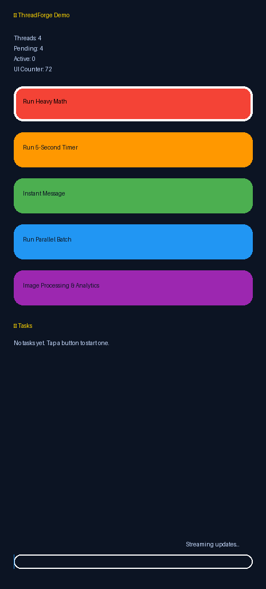

# ThreadForge Demo App & Library

<p align="center">
  
</p>

<p align="center">
  <a href="https://reactnative.dev"></a>
  <a href="https://www.typescriptlang.org/"></a>
  <a href="./LICENSE"></a>
  <a href="#community--support"></a>
</p>

> **ThreadForge** is a teaching lab and reusable toolkit that shows how to push React Native beyond the main JS thread—without sacrificing DX or UX. The repo bundles a polished showcase app plus the `react-native-threadforge` package they both rely on.

---

## ✨ Highlights

<table>
  <tr>
    <td>🧪 <strong>Hands-on demo lab</strong><br />Explore real-world scenarios (heavy math, image transforms, batched persistence) with live progress indicators and configurable knobs.</td>
    <td>🧰 <strong>Production-ready library</strong><br />Drop the `react-native-threadforge` package into any Hermes-powered app to offload synchronous JS to native-backed worker pools.</td>
  </tr>
  <tr>
    <td>🧭 <strong>Guided learning paths</strong><br />Follow scenario cards, architecture sketches, and narrated walkthroughs that double as onboarding material for your team.</td>
    <td>📈 <strong>Observability first</strong><br />Ship with built-in telemetry hooks, structured logging, and performance dashboards you can adapt to your own stack.</td>
  </tr>
</table>

---

## 📦 What’s Inside?

| Package | Description | Quick peek |
| --- | --- | --- |
| [`/`](./) | Showcase application built with Expo-style ergonomics that demonstrates background work patterns, UX strategies, and testing approaches. | [`App.tsx`](./App.tsx) · [`src/screens`](./src) |
| [`packages/react-native-threadforge`](./packages/react-native-threadforge) | The reusable worker orchestration library with TypeScript typings and native bridges for iOS & Android. | [`src/index.ts`](./packages/react-native-threadforge/src/index.ts) |
| [`docs/assets`](./docs/assets) | Logos, screenshots, and diagrams for documentation and presentations. | [`threadforge-demo.gif`](./docs/assets/threadforge-demo.gif) |

---

## 🚀 Quick Start (Demo App)

```bash
# Clone & install
git clone https://github.com/your-org/threadforge.git
cd threadforge
npm install

# Start Metro & run on your favorite platform
npm start        # launches Expo-style dev server
npm run ios      # or npm run android
```

<details>
<summary><strong>Preflight checklist</strong></summary>

- ✅ Node.js 18+ and npm 9+
- ✅ Watchman (macOS/Linux) for faster file watching
- ✅ Xcode 15+ (macOS) and/or Android Studio with SDK Platform 34
- ✅ Ruby + CocoaPods (`sudo gem install cocoapods` or via `brew`)

</details>

<p align="center">
  
</p>

---

## 🧵 Library at a Glance

```ts
import { threadForge, TaskPriority } from 'react-native-threadforge';

await threadForge.initialize(4, {
  progressThrottleMs: 100,
});

const result = await threadForge.runTask({
  id: 'pi-sim',
  priority: TaskPriority.High,
  worklet() {
    let total = 0;
    for (let i = 0; i < 5_000_000; i++) {
      total += Math.sqrt(i);
      if (i % 200_000 === 0) reportProgress(i / 5_000_000);
    }
    return total;
  },
});
```

- 🔐 Built for Hermes: each worker is its own Hermes runtime with isolated memory.
- 🎯 Priorities, cancellation tokens, and debounced progress events out of the box.
- 🪝 Hooks for analytics/logging (`onTaskStart`, `onTaskComplete`, `onError`).
- 📦 Zero-config defaults, but everything is overrideable via DI-style factories.

See the [library README](./packages/react-native-threadforge/README.md) for deep dives, API docs, and recipes.

---

## 🗺️ Guided Tour

| Scene | What you’ll learn | Source |
| --- | --- | --- |
| **Crash Course** | Intro to multi-threaded JS, worker pool limits, UI-safe progress indicators. | [`src/screens/Welcome`](./src/screens/Welcome) |
| **Image Alchemist** | Pixel manipulations, transferable buffers, cancellation UX patterns. | [`src/screens/ImageLab`](./src/screens/ImageLab) |
| **Number Forge** | CPU-bound loops, prioritization, telemetry overlays. | [`src/screens/NumberForge`](./src/screens/NumberForge) |
| **Persistence Lab** | Batched database writes with optimistic UI. | [`src/screens/PersistenceLab`](./src/screens/PersistenceLab) |

Each scene ships with “try it” callouts, commentary, and toggles for instrumentation. Open the screen files to follow along with the README explanations.

---

## 🧭 Architecture Snapshot

```
┌───────────────────────┐    enqueue()     ┌───────────────────────┐
│ React Native UI Layer │ ───────────────▶ │ ThreadForge Scheduler │
└───────────────────────┘                  └────────┬──────────────┘
          ▲                                        │
          │ progress/result events                 ▼
┌───────────────────────┐    Hermes bridge    ┌───────────────────────┐
│   Worker Runtime (n)  │ ◀────────────────── │   Native Bridges      │
└───────────────────────┘                     └───────────────────────┘
```

- React components submit serializable worklets.
- Scheduler maps them to Hermes-backed native threads.
- Workers stream progress, logs, and final payloads back to JS.
- Observability hooks mirror every transition for analytics or debugging.

---

## 🛠️ Common Tasks

<details>
<summary><strong>Configure worker pool size</strong></summary>

```ts
threadForge.initialize(6, {
  fallbackPriority: TaskPriority.Normal,
  progressThrottleMs: 75,
});
```

</details>

<details>
<summary><strong>Listen for progress globally</strong></summary>

```ts
const subscription = threadForge.onProgress((taskId, value) => {
  console.log(`[${taskId}] ${(value * 100).toFixed()}%`);
});
```

</details>

<details>
<summary><strong>Cancel long-running work</strong></summary>

```ts
const controller = threadForge.createAbortController();
threadForge.runTask({ id: 'report', signal: controller.signal, worklet: generateReport });
controller.abort();
```

</details>

---

## 🧪 Testing & Tooling

| Command | Purpose |
| --- | --- |
| `npm test` | Run Jest suites for the demo + library. |
| `npm run lint` | ESLint with React Native, TypeScript, and Jest configs. |
| `npm run typecheck` | Strict TypeScript validation for all packages. |
| `npm run build:lib` | Produce the publishable library bundle. |

See [`package.json`](./package.json) for the complete script catalog.

---

## 🤝 Contributing

We love actionable contributions! Before opening a PR:

1. Review the [issue tracker](https://github.com/your-org/threadforge/issues) to avoid duplicates.
2. Run the test + lint suite.
3. Follow the architectural patterns outlined in [`docs/architecture.md`](./docs/architecture.md) (coming soon!).

If you’re proposing major changes, open a discussion first so we can co-design the approach.

---

## 📣 Community & Support

- 💬 Join the conversation in **#threadforge** on our community Slack (request an invite via `team@threadforge.dev`).
- 🐞 Found a bug? [Open an issue](https://github.com/your-org/threadforge/issues/new/choose) with repro steps and environment details.
- 🧭 Need consultation? Book office hours with the maintainers via Calendly (link in Slack topic).

---

## 🗺️ Roadmap Snapshot

- [x] Hermes worker pools with dynamic sizing
- [x] Structured telemetry + progress streaming
- [ ] SharedArrayBuffer support for zero-copy transfers
- [ ] Desktop (React Native for macOS/Windows) adapters
- [ ] GUI profiler overlay baked into the demo app

---

## 📄 License

Licensed under the [MIT License](./LICENSE). Use it, remix it, and ship performant apps without the main-thread jank.

---

<p align="center">Made with ❤️ by the ThreadForge maintainers.</p>
