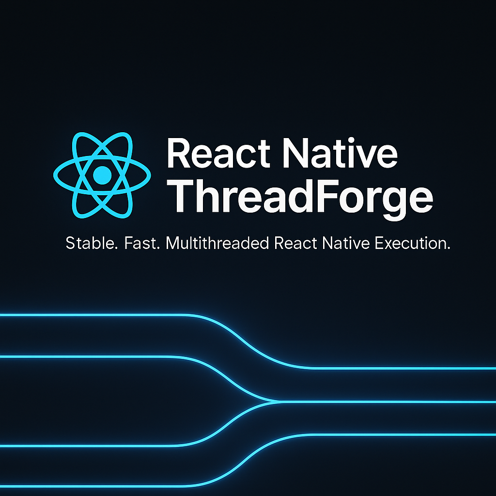
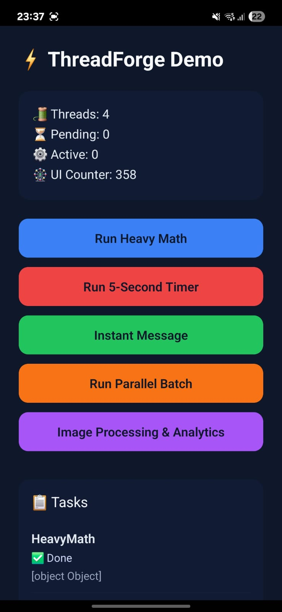

# 🚀 react-native-threadforge

<p align="center">
  
</p>

**ThreadForge** brings real multi-threading to React Native. It runs serializable JavaScript functions on background threads using a high-performance C++ worker pool — freeing up your main thread for smooth, responsive UIs.

Crafted by [**Abhishek Kumar**](https://www.linkedin.com/in/i-am-abhishek-kumar/).

---

## ✨ Features

- 🧵 **True multi-threading** for JavaScript in React Native apps
- ⚙️ Hermes-first with validation and graceful fallbacks
- 🚦 **Progress reporting** and **task cancellation** built-in
- 🔧 Fully configurable **thread count** and **throttle**
- 📦 Drop-in integration with a simple TypeScript API

---

## 📦 Installation

```bash
npm install react-native-threadforge
# or
yarn add react-native-threadforge
```

Then link native modules:

```bash
npx pod-install
```

### ✅ Requirements

- React Native **0.70+**
- Hermes enabled (`android/gradle.properties` & `ios/Podfile`)
- Android NDK / Xcode installed

---

## 🎬 Demo

<p align="center">
  
</p>

<details>
<summary>📸 Static Preview</summary>



</details>

Try the full example app by cloning the repository:

```bash
git clone https://github.com/alexrus28996/react-native-threadforge.git
cd react-native-threadforge
npm install
npm run ios # or npm run android
```

➡️ GitHub: [https://github.com/alexrus28996/react-native-threadforge](https://github.com/alexrus28996/react-native-threadforge)

---

## ⚡ Quick Start

```tsx
import {
  threadForge,
  TaskPriority,
  ThreadForgeCancelledError,
} from 'react-native-threadforge';

await threadForge.initialize();

const sub = threadForge.onProgress((id, progress) => {
  console.log(`Progress for ${id}: ${progress}`);
});

try {
  const result = await threadForge.runFunction(
    'heavy-task',
    () => {
      const values = Array.from({ length: 1000 }, (_, i) => Math.sin(i));
      const sum = values.reduce((acc, v) => acc + v, 0);
      globalThis.reportProgress?.(1);
      return { sum };
    },
    TaskPriority.HIGH
  );
  console.log(result);
} catch (err) {
  if (err instanceof ThreadForgeCancelledError) {
    console.warn('Task was cancelled');
  } else {
    console.error(err);
  }
}

sub.remove();
await threadForge.shutdown();
```

> 💡 In Hermes release builds, preserve source using `__threadforgeSource` (see [`src/tasks/threadHelpers.ts`](../../src/tasks/threadHelpers.ts))

---

## 🛠 API Overview

### `initialize(threadCount?, options?)`
Boot up the thread pool. Defaults to 4 threads.

### `runFunction(id, worklet, priority?)`
Execute a serializable worklet. Returns a `Promise<T>`.

### `onProgress(listener)`
Subscribe to progress updates `(id, progress: 0-1)`.

### `cancelTask(id)`
Request cancellation of a running or queued task.

### `getStats()`
Returns `{ threadCount, pending, active }`.

### `shutdown()`
Tears down the thread pool.

### `isInitialized()`
Returns boolean indicating init status.

### `ThreadForgeCancelledError`
Error class thrown when a task is canceled.

### `TaskPriority`
Enum: `LOW`, `NORMAL`, `HIGH`

---

## 🧩 Architecture

- **JS Layer** – TypeScript engine for clean API
- **Android** – Kotlin + JNI calling into native C++
- **iOS** – Obj-C++ bridge using GCD
- **C++ Core** – Thread pool + Hermes VM + JSON serialization

---

## 🧪 Tests & Linting

```bash
npm test           # Run Jest tests
npm run lint       # Check ESLint rules
npm run typescript # Validate types
```

---

## 📜 License & Author

- MIT License – [LICENSE](../../LICENSE)
- Developed by [Abhishek Kumar](https://www.linkedin.com/in/i-am-abhishek-kumar/)

---

## 💡 Pro Tips

- ✅ Use `shutdown()` to release native resources
- 🧩 Worklets must be **pure functions** — no closures or side effects
- ⚠️ Use `progressThrottleMs` carefully to avoid bridge overload
- 🔍 Detect cancellation with `ThreadForgeCancelledError`
- 📊 Use `getStats()` for task queue visibility