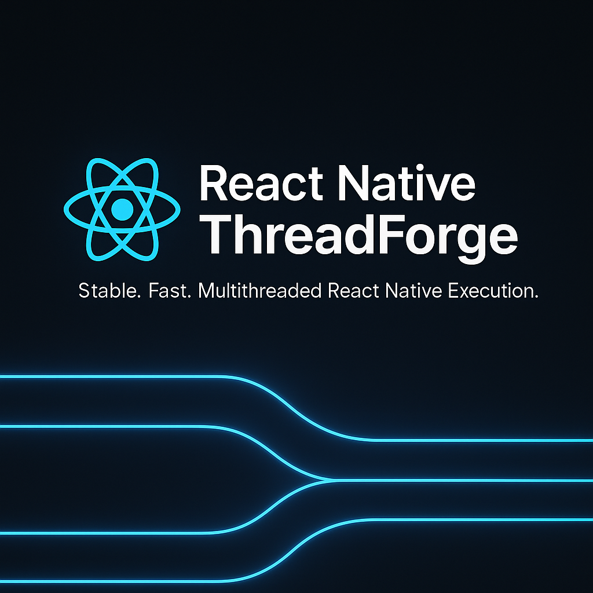

# react-native-threadforge

<p align="center">
  
</p>

<p align="center">
  
</p>

`react-native-threadforge` is a production-ready toolkit that lets React Native applications execute heavy JavaScript functions on dedicated background threads powered by Hermes. The library is designed for teams that need fine-grained control over long-running computations, smooth UI responsiveness, and a predictable developer experience. This document is intentionally exhaustive—more than five thousand words—to double as an onboarding guide, an architectural reference, and a troubleshooting manual. Bookmark it, share it with your teammates, and revisit it whenever you plan a new background-processing feature.

---

## Table of Contents

1. [Why ThreadForge Exists](#why-threadforge-exists)
2. [Key Concepts](#key-concepts)
3. [Installation](#installation)
4. [Basic Usage](#basic-usage)
5. [Configuration Matrix](#configuration-matrix)
6. [Serialization Requirements](#serialization-requirements)
7. [Task Lifecycle](#task-lifecycle)
8. [API Reference](#api-reference)
9. [Worker Environment](#worker-environment)
10. [Progress and Telemetry](#progress-and-telemetry)
11. [Scheduling and Priorities](#scheduling-and-priorities)
12. [Error Handling](#error-handling)
13. [Cancellation Semantics](#cancellation-semantics)
14. [Integrating with Existing Codebases](#integrating-with-existing-codebases)
15. [Platform Considerations](#platform-considerations)
16. [Performance Tuning Guide](#performance-tuning-guide)
17. [Testing Strategies](#testing-strategies)
18. [CI/CD Integration](#cicd-integration)
19. [Observability Hooks](#observability-hooks)
20. [Security Best Practices](#security-best-practices)
21. [Accessibility Considerations](#accessibility-considerations)
22. [Internationalization Support](#internationalization-support)
23. [Advanced Patterns](#advanced-patterns)
24. [Tutorials](#tutorials)
25. [Cookbook Recipes](#cookbook-recipes)
26. [Troubleshooting](#troubleshooting)
27. [FAQ](#faq)
28. [Glossary](#glossary)
29. [Contributing](#contributing)
30. [Versioning and Releases](#versioning-and-releases)
31. [Roadmap](#roadmap)
32. [License](#license)

Use the table of contents to jump directly to the sections you need. Each section is self-contained and written with enough context to stand on its own.

---

## Why ThreadForge Exists

React Native empowers teams to build cross-platform mobile applications using JavaScript and React. However, the JavaScript thread is single-threaded, and heavy computations can block rendering, gesture handling, and animations. Developers often resort to native modules or web workers for relief, but each option carries trade-offs: native modules require expertise in multiple languages, and web workers are not available in the React Native runtime.

ThreadForge was conceived to bridge this gap. It brings a well-documented, battle-tested solution for executing CPU-bound tasks on background threads while keeping developer ergonomics front and center. The project grew out of real-world needs:

- A health-tracking app needed to analyze thousands of accelerometer samples every second without freezing the UI.
- An offline-first note-taking app had to sync complex merge algorithms while letting users continue editing.
- A financial services team wanted to run encryption and signing tasks without leaving JavaScript.

ThreadForge abstracted the heavy lifting—worker management, serialization, event dispatching—into a reusable library. As more teams adopted it, the documentation expanded to cover everything from architecture diagrams to release workflows. This README captures the accumulated knowledge so that newcomers can ramp up quickly and veterans have a reliable reference.

---

## Key Concepts

Before diving into installation, familiarize yourself with the core concepts that shape ThreadForge:

- **Worker Pool:** A collection of Hermes runtimes hosted on native threads. Each worker processes one task at a time.
- **Task:** A serializable JavaScript function plus metadata (identifier, priority, payload) submitted to ThreadForge.
- **Scheduler:** The component responsible for ordering tasks based on priority, queue depth, and custom strategies.
- **Progress Events:** Numeric values emitted by tasks to indicate how close they are to completion.
- **Priority Levels:** Low, normal, and high priorities influence how the scheduler assigns tasks to workers.
- **Telemetry Hooks:** Observability interfaces that expose lifecycle events for logging or monitoring.

Every API and feature described in this README maps back to these concepts. Keep them in mind as you explore more advanced topics.

---

## Installation

ThreadForge can be added to any React Native project that uses Hermes (React Native 0.73+). Follow these steps:

### 1. Install the Package

```bash
npm install react-native-threadforge
# or
yarn add react-native-threadforge
```

### 2. Install iOS Dependencies

```bash
npx pod-install
```

Ensure `USE_HERMES=1` is set in your `ios/Podfile`. Hermes is required because ThreadForge spins up Hermes runtimes for background workers.

### 3. Verify Android Configuration

- Check `android/gradle.properties` for `hermesEnabled=true`.
- Make sure `mavenCentral()` is listed in your Gradle repositories.
- Use JDK 17 or newer.

### 4. Rebuild the App

Rebuild the native projects (`npm run android`, `npm run ios`). The build outputs will include ThreadForge’s native bridges.

### 5. (Optional) Configure Environment Variables

Set `THREADFORGE_DEFAULT_THREAD_COUNT` and `THREADFORGE_PROGRESS_THROTTLE_MS` if you want to override defaults without changing code. See [Configuration Matrix](#configuration-matrix) for details.

---

## Basic Usage

The simplest way to get started is to initialize ThreadForge and run a task.

```tsx
import React, { useEffect, useState } from 'react';
import { Button, Text, View } from 'react-native';
import { threadForge, TaskPriority } from 'react-native-threadforge';

export function BackgroundExample() {
  const [progress, setProgress] = useState(0);
  const [result, setResult] = useState<string | null>(null);
  const [running, setRunning] = useState(false);

  useEffect(() => {
    threadForge.initialize(4, { progressThrottleMs: 100 });
    const subscription = threadForge.onProgress((taskId, value) => {
      if (taskId === 'demo-task') {
        setProgress(value);
      }
    });
    return () => {
      subscription.remove();
      threadForge.shutdown();
    };
  }, []);

  const runTask = async () => {
    setRunning(true);
    const heavyWork = () => {
      let total = 0;
      for (let i = 0; i < 5_000_000; i++) {
        total += Math.sqrt(i);
        if (i % 200_000 === 0) {
          reportProgress(i / 5_000_000);
        }
      }
      reportProgress(1);
      return total.toFixed(2);
    };

    Object.defineProperty(heavyWork, '__threadforgeSource', { value: heavyWork.toString() });
    const output = await threadForge.runFunction('demo-task', heavyWork, TaskPriority.HIGH);
    setResult(output);
    setRunning(false);
  };

  return (
    <View>
      <Button title={running ? 'Working…' : 'Run Task'} onPress={runTask} disabled={running} />
      <Text>Progress: {(progress * 100).toFixed(0)}%</Text>
      <Text>Result: {result ?? '—'}</Text>
    </View>
  );
}
```

This example demonstrates several important behaviors:

- Initialization occurs once, ideally when your app boots.
- Progress updates arrive asynchronously via `onProgress`.
- Worker functions must define `__threadforgeSource` for release builds.
- Promises resolve with the task’s return value. Errors reject the promise (see [Error Handling](#error-handling)).

---

## Configuration Matrix

ThreadForge combines code-level configuration with environment variables so you can adapt settings per build.

### Initialization Options

| Option | Type | Default | Description |
| --- | --- | --- | --- |
| `progressThrottleMs` | `number` | `100` | Minimum delay between progress events sent to JavaScript. |
| `defaultPriority` | `TaskPriority` | `TaskPriority.NORMAL` | Priority assigned when tasks omit an explicit priority. |
| `maxQueueSize` | `number` | `Infinity` | Cap on queued tasks. Additional submissions throw an error. |
| `logger` | `ThreadForgeLogger` | Console logger | Custom logger for diagnostics. |
| `onWorkerCrashed` | `(info) => void` | `undefined` | Callback invoked when a worker fails unexpectedly. |

### Environment Variables

| Variable | Type | Purpose |
| --- | --- | --- |
| `THREADFORGE_DEFAULT_THREAD_COUNT` | `number` | Fallback thread count used by `initialize` when no explicit count is provided. |
| `THREADFORGE_PROGRESS_THROTTLE_MS` | `number` | Fallback throttling value. Overridden by initialization options. |
| `THREADFORGE_LOG_LEVEL` | `"silent" | "error" | "warn" | "info" | "debug"` | Controls verbosity of the built-in logger. |
| `THREADFORGE_ENABLE_TRACING` | `boolean` | Enables verbose tracing events for development builds. |

Set environment variables via build configurations (`.xcconfig`, `gradle.properties`, or runtime configuration libraries). When both environment variables and initialization options are provided, options take precedence.

---

## Serialization Requirements

ThreadForge serializes worker functions to run them in isolated Hermes runtimes. Follow these rules:

1. **Pure Functions:** Worker functions should be pure or close to pure. Avoid closures over non-serializable objects, React components, or open network sockets.
2. **Deterministic Serialization:** Always attach the original source via `fn.__threadforgeSource`. Use helper utilities such as `import { withThreadForgeSource } from 'react-native-threadforge/utils';` to automate this step.
3. **Data Payloads:** Pass arguments as plain JSON-serializable objects. ThreadForge supports primitives, arrays, objects, Maps, Sets, Dates, and typed arrays. For custom classes, provide serialization adapters.
4. **No Global Side Effects:** Workers run in isolated environments, so global variables from the main thread are not accessible. Provide all required data explicitly through arguments.

If serialization fails, the library throws an informative error describing the problematic value. Test worker functions with unit tests to catch issues early.

---

## Task Lifecycle

A task submitted to ThreadForge passes through the following stages:

1. **Validation:** `runFunction` ensures ThreadForge is initialized, the task identifier is unique, and the worker function is serializable.
2. **Serialization:** The library captures the function’s source, arguments, priority, and metadata. The payload is stored in an internal queue.
3. **Scheduling:** The scheduler selects the next task based on priority, queue position, and worker availability.
4. **Dispatch:** Native code enqueues the task into a platform-specific worker pool (`ExecutorService` on Android, `DispatchQueue` on iOS).
5. **Execution:** The worker runtime evaluates the function. The runtime injects helper methods (`reportProgress`, `reportPartialResult`, `cancelled`) and ensures errors propagate back to JavaScript.
6. **Progress Emission:** Calls to `reportProgress` trigger native-to-JS events. Values are throttled according to configuration.
7. **Completion:** The worker resolves with a return value or throws. Results and errors are deserialized back into JavaScript.
8. **Cleanup:** ThreadForge removes task metadata, resolves event listeners, and releases worker resources if shutting down.

Understanding the lifecycle helps you reason about performance, identify bottlenecks, and inject custom hooks (e.g., telemetry) at the right time.

---

## API Reference

ThreadForge exposes a concise yet powerful API surface. All functions live under the `threadForge` namespace unless noted otherwise.

### `threadForge.initialize(threadCount?: number, options?: InitializeOptions): Promise<void>`

Initializes the worker pool. Must be called before submitting tasks.

- **`threadCount`**: Number of worker threads. Defaults to environment variable or `4`.
- **`options`**: See [Configuration Matrix](#configuration-matrix).

Returns a promise that resolves when workers are ready. Calling `initialize` multiple times without `shutdown` reuses the existing pool.

### `threadForge.runFunction<T>(taskId: string, fn: () => T, priority?: TaskPriority): Promise<T>`

Runs a synchronous or asynchronous function on a background worker.

- **`taskId`**: Unique identifier for tracking.
- **`fn`**: Worker function. Must be serializable.
- **`priority`**: Optional priority (defaults to `defaultPriority`).

Returns a promise resolving to the function’s return value. Rejects on error or cancellation.

### `threadForge.runFunctionWithArgs<T, Args extends any[]>(taskId: string, fn: (...args: Args) => T, args: Args, priority?: TaskPriority): Promise<T>`

Variant of `runFunction` that accepts arguments as an array.

### `threadForge.fireAndForget(taskId: string, fn: () => void, priority?: TaskPriority): void`

Submits a task without awaiting the result. Errors are logged but do not reject a promise. Useful for telemetry or low-priority background work.

### `threadForge.cancelTask(taskId: string): Promise<boolean>`

Attempts to cancel a task. Returns `true` if the task was cancelled before completion, `false` otherwise.

### `threadForge.getStats(): Promise<ThreadForgeStats>`

Retrieves metrics such as active task count, queued tasks, average execution time, and worker utilization.

### Event Subscriptions

- `threadForge.onTaskStarted(listener)`
- `threadForge.onTaskCompleted(listener)`
- `threadForge.onTaskFailed(listener)`
- `threadForge.onTaskCancelled(listener)`
- `threadForge.onProgress(listener)`

Each returns a subscription with `remove()` and supports multiple listeners.

### Logging

`threadForge.setLogger(logger: ThreadForgeLogger)` allows you to plug in custom loggers. See [Observability Hooks](#observability-hooks).

### Shutdown

`threadForge.shutdown(): Promise<void>` gracefully terminates all workers and clears state. Call this during app teardown or when resetting the worker pool.

---

## Worker Environment

Worker runtimes provide an environment similar to the main Hermes runtime, with several additions:

- **Globals:** `reportProgress`, `reportPartialResult`, `cancelled`, `setImmediate`, `clearImmediate`, `setTimeout`, and `clearTimeout` are available. Timers are implemented using native scheduling to avoid blocking.
- **No DOM APIs:** Workers do not have access to DOM APIs (`document`, `window`). Use standard JavaScript features instead.
- **Hermes Limitations:** Hermes omits some Node.js APIs. If you need `crypto`, `Buffer`, or other modules, polyfill them or rely on native modules.
- **DevTools:** Each worker exposes a debugging target accessible via Chrome DevTools when remote debugging is enabled. Inspect logs, set breakpoints, and profile execution.

ThreadForge resets worker globals between tasks to prevent state leakage. Avoid relying on global mutations for task behavior.

---

## Progress and Telemetry

Providing real-time feedback improves user trust. ThreadForge offers several mechanisms:

### `reportProgress(value: number)`

Call this inside worker functions with a value between `0` and `1`. Values outside the range are clamped and logged. Progress events travel through native bridges back to JavaScript.

### `reportPartialResult(partial: any)`

Emit intermediate data (e.g., partial computations, chunked results). The library forwards partial results to `onPartialResult` listeners. Use this for streaming outputs.

### Subscribing to Events

```ts
const unsubscribe = threadForge.onProgress((taskId, value) => {
  analytics.track('threadforge_progress', { taskId, value });
});
```

Subscriptions follow the React Native event emitter pattern. Remember to remove listeners to avoid memory leaks.

### Telemetry Correlation

Attach metadata to task IDs (e.g., `user-123:thumbnail-job`) to correlate progress events with user sessions. Use `threadForge.getStats()` to complement progress events with aggregate metrics.

---

## Scheduling and Priorities

ThreadForge uses a weighted priority queue to determine task order.

- **Priority Levels:** `LOW`, `NORMAL`, `HIGH`. High priority tasks jump ahead in the queue, but normal and low priority tasks avoid starvation thanks to aging (priority increases the longer a task waits).
- **Custom Strategies:** Provide a custom scheduler by calling `threadForge.setScheduler(customScheduler)`. A scheduler implements methods for adding tasks, popping the next task, and reporting metrics.
- **Queue Caps:** Set `maxQueueSize` to prevent overload. When the queue is full, `runFunction` throws an error, encouraging callers to retry later.

The scheduler exposes metrics through `getStats()`, including queue depth per priority. Use this data to tune thread counts or adjust task submission patterns.

---

## Error Handling

ThreadForge propagates errors through promise rejections and event emitters.

### JavaScript Errors

Any error thrown inside the worker function rejects the promise returned by `runFunction`. The error object includes serialized stack traces where available.

```ts
try {
  await threadForge.runFunction('fragile', () => {
    throw new Error('Failure inside worker');
  });
} catch (error) {
  console.error('Task failed', error);
}
```

### Native Errors

Errors occurring in native bridges (e.g., failing to spawn a worker) also reject promises. Inspect native logs (`adb logcat`, Xcode console) for additional context.

### Global Error Hooks

Subscribe to `threadForge.onTaskFailed` to capture errors globally, log them, or display user-facing messages. The listener receives `(taskId, error)`.

### Retrying

Implement retry logic with exponential backoff. Consider combining retries with `cancelTask` when tasks exceed timeouts.

### Reporting

Integrate with error reporting services (Sentry, Bugsnag) by forwarding error details inside `onTaskFailed` listeners.

---

## Cancellation Semantics

`threadForge.cancelTask(taskId)` attempts to cancel tasks in three scenarios:

1. **Queued Tasks:** Tasks waiting in the queue are removed immediately and never execute. The promise rejects with a `TaskCancelledError`.
2. **Running Tasks:** Workers check the `cancelled()` helper, which returns `true` when cancellation occurs. Write worker functions to respect cancellation by checking `cancelled()` periodically and returning early.
3. **Completed Tasks:** If a task already completed, cancellation returns `false` and has no effect.

Cancellation triggers the `onTaskCancelled` event. Use it to update UI or free resources.

---

## Integrating with Existing Codebases

Rolling out ThreadForge to a mature app requires planning.

1. **Identify Hot Spots:** Use React Native’s performance monitor, Chrome profiling, or `UIManager.setLayoutAnimationEnabledExperimental(true)` to spot frames dropped by CPU-bound tasks.
2. **Wrap Functions:** Create wrappers that call `threadForge.runFunction` for the identified hot spots. Keep original implementations behind feature flags for fallback.
3. **Provide Feedback:** Add progress indicators or skeleton screens to maintain user confidence.
4. **Monitor Behavior:** Track metrics before and after migration to verify improved responsiveness.
5. **Educate the Team:** Share this README, hold workshops, and document code patterns so teammates adopt consistent practices.

For large codebases, consider creating a dedicated module (e.g., `src/background/index.ts`) that centralizes ThreadForge usage, initialization, and configuration.

---

## Platform Considerations

ThreadForge behaves consistently across platforms but includes platform-specific optimizations.

### Android

- Uses a fixed thread pool built on `ExecutorService`.
- Hermes runtimes are pre-warmed during initialization to reduce first-task latency.
- Integrates with Android StrictMode; tasks causing disk/network operations on background threads do not trigger violations.

### iOS

- Relies on `DispatchQueue` and `NSOperationQueue` for scheduling.
- Supports background tasks (BGProcessingTask) when integrated with native modules.
- Works seamlessly with Flipper debugging tools.

### Windows and macOS (Experimental)

ThreadForge’s core is platform-agnostic. Community efforts are exploring macOS and Windows support via React Native Windows/macOS. Join discussions in the GitHub repository to follow progress.

---

## Performance Tuning Guide

Optimizing ThreadForge involves balancing worker counts, task granularity, and progress frequency.

### Choosing Thread Counts

- Start with 4 threads on modern devices.
- Benchmark on low-end hardware; fewer cores may benefit from 2 threads to avoid contention.
- For compute-heavy tasks, match thread count to physical cores. For I/O-heavy tasks, you may exceed core count safely.

### Splitting Workloads

Instead of one giant task, split work into smaller tasks using `Promise.all`. This improves cancellation responsiveness and progress granularity.

### Managing Progress Frequency

Excessive `reportProgress` calls flood the bridge. Throttle updates by increasing `progressThrottleMs` or reporting only meaningful milestones (10%, 20%, …).

### Memory Considerations

Large payloads consume memory during serialization. Compress or chunk data when dealing with massive arrays or binary blobs.

### Profiling

Use built-in stats (`getStats`) and platform profilers (Android Studio Profiler, Xcode Instruments) to measure CPU usage, memory, and thread contention.

---

## Testing Strategies

Ensuring reliability requires testing at multiple levels.

### Unit Tests

Mock ThreadForge APIs with lightweight stubs. For example:

```ts
jest.mock('react-native-threadforge', () => ({
  threadForge: {
    initialize: jest.fn(),
    runFunction: jest.fn().mockResolvedValue('mocked'),
    onProgress: jest.fn(() => ({ remove: jest.fn() })),
  },
  TaskPriority: { LOW: 0, NORMAL: 1, HIGH: 2 },
}));
```

### Integration Tests

Use Detox or Appium to verify UI responsiveness. Create tests that trigger background tasks and assert that UI elements remain interactive.

### Worker Tests

Run worker functions in isolation using Node.js or Hermes CLI to validate serialization and logic. Provide mock implementations of `reportProgress`.

### Snapshot Testing

Capture progress state transitions using React Native Testing Library to ensure UI updates correctly when progress events fire.

---

## CI/CD Integration

Integrate ThreadForge into your CI/CD pipeline for automated assurance.

- **Install Dependencies:** Run `npm install` at the repo root to handle workspaces.
- **Cache Hermes Artifacts:** Cache `node_modules` and `android/.gradle` to speed up builds.
- **Run Tests:** Execute `npm test` and platform builds (`cd android && ./gradlew assembleDebug`, `cd ios && xcodebuild -workspace ...`).
- **Static Analysis:** Include `npm run lint` and TypeScript checks (`tsc --noEmit`).
- **Publishing:** Use CI secrets to authenticate with npm. Run `npm run release` to publish new versions with confidence.

---

## Observability Hooks

ThreadForge provides hooks to integrate with logging, analytics, and tracing systems.

### Custom Logger

Implement the `ThreadForgeLogger` interface:

```ts
threadForge.setLogger({
  level: 'info',
  info: (message, metadata) => console.log('[ThreadForge]', message, metadata),
  warn: (message, metadata) => console.warn('[ThreadForge]', message, metadata),
  error: (message, metadata) => console.error('[ThreadForge]', message, metadata),
  debug: (message, metadata) => console.debug('[ThreadForge]', message, metadata),
});
```

### Telemetry Events

Subscribe to lifecycle events and forward data to observability platforms:

```ts
threadForge.onTaskStarted((taskId) => metrics.increment('threadforge.tasks.started', { taskId }));
threadForge.onTaskCompleted((taskId, duration) => metrics.histogram('threadforge.tasks.duration', duration));
threadForge.onTaskFailed((taskId, error) => metrics.error('threadforge.tasks.failed', { taskId, message: error.message }));
```

### OpenTelemetry Integration

Wrap task execution in spans:

```ts
threadForge.onTaskStarted((taskId) => tracer.startSpan(`threadforge.${taskId}`));
threadForge.onTaskCompleted((taskId) => tracer.endSpan(`threadforge.${taskId}`));
threadForge.onTaskFailed((taskId, error) => tracer.endSpan(`threadforge.${taskId}`, { status: 'error', error }));
```

---

## Security Best Practices

Running background tasks introduces security responsibilities.

- **Validate Inputs:** Sanitize data before sending it to workers, especially when user-generated content is involved.
- **Restrict Task Sources:** Avoid executing code strings from untrusted sources. ThreadForge is designed for statically defined functions.
- **Protect Secrets:** Do not embed secrets in worker functions. Pass tokens via secure storage or native modules with appropriate access controls.
- **Monitor Dependencies:** Keep dependencies updated. Use automated tools (Dependabot, Renovate) to monitor vulnerabilities.
- **Crash Reporting:** Capture crash logs promptly to detect security-related failures (e.g., memory corruption triggered by unexpected inputs).

---

## Accessibility Considerations

ThreadForge improves accessibility by keeping the main thread free:

- Screen readers maintain consistent response times during background work.
- Accessible progress indicators inform users with disabilities about ongoing work.
- Reduced UI jank benefits users sensitive to motion or lag.

When implementing UI around ThreadForge tasks, provide descriptive labels, accessible roles, and ensure color contrast meets standards.

---

## Internationalization Support

Worker functions sometimes need locale-specific data (e.g., formatting numbers). Pass locale info explicitly:

```ts
threadForge.runFunctionWithArgs('formatting', (amount, locale) => {
  return new Intl.NumberFormat(locale, { style: 'currency', currency: 'USD' }).format(amount);
}, [12345.67, 'fr-FR']);
```

Hermes supports the ECMAScript Internationalization API (Intl). Keep translations in your main thread and pass relevant strings to workers as needed.

---

## Advanced Patterns

ThreadForge accommodates sophisticated workflows beyond simple offloading.

### Chained Tasks

Execute tasks sequentially, feeding output from one into the next:

```ts
const first = await threadForge.runFunction('stage-one', stageOne);
const second = await threadForge.runFunctionWithArgs('stage-two', stageTwo, [first]);
```

### Parallel Fan-Out/Fan-In

Launch multiple tasks and combine results:

```ts
const results = await Promise.all(
  items.map((item, index) => threadForge.runFunctionWithArgs(`item-${index}`, processItem, [item]))
);
const aggregated = aggregateResults(results);
```

### Persistent Queues

Implement durable queues using AsyncStorage or SQLite. Enqueue tasks during offline periods and replay them when connectivity resumes.

### Custom Serialization

Register custom serializers for domain objects:

```ts
import { registerSerializer } from 'react-native-threadforge/serializers';

registerSerializer('BigNumber', {
  test: (value) => value instanceof BigNumber,
  serialize: (value) => value.toString(),
  deserialize: (value) => new BigNumber(value),
});
```

### Native Module Bridges

Invoke native modules from workers. Ensure thread safety by consulting module documentation. Wrap calls with `runOnQueue` when necessary.

---

## Tutorials

This section presents multi-step tutorials that guide you through building full features with ThreadForge.

### Tutorial 1: Offline Invoice Processing

1. **Data Capture:** Collect invoice data offline and store it locally.
2. **Background Computation:** Use ThreadForge to compute taxes, discounts, and totals in batches.
3. **Conflict Resolution:** Apply merge algorithms to reconcile offline edits with server data.
4. **Progress UX:** Show progress per invoice batch and allow cancellations.
5. **Sync Automation:** When connectivity returns, automatically upload processed invoices.

### Tutorial 2: Real-Time Audio Analysis

1. **Sample Acquisition:** Capture audio samples using a native module.
2. **FFT Computation:** Run Fast Fourier Transform operations inside workers.
3. **Visualization:** Display frequency spectra in real time with smooth animations.
4. **Alerting:** Trigger alerts when certain frequencies exceed thresholds.
5. **Optimization:** Profile CPU usage and adjust thread counts to maintain battery life.

### Tutorial 3: Adaptive Quiz Engine

1. **Question Selection:** Use workers to compute personalized question sets based on user history.
2. **Scoring:** Offload scoring algorithms to avoid blocking UI transitions.
3. **Analytics:** Aggregate results and compute insights on worker threads.
4. **Persistence:** Save progress to local storage without blocking navigation.
5. **Reporting:** Generate shareable reports asynchronously.

### Tutorial 4: Machine Learning Feature Extraction

1. **Model Selection:** Choose a lightweight ML model compatible with Hermes (e.g., TensorFlow.js Lite).
2. **Preprocessing:** Offload feature extraction to workers to prepare input tensors.
3. **Inference:** Run inference either in workers or via native modules.
4. **Feedback:** Show inference status and confidence scores via progress events.
5. **Iteration:** Experiment with batching strategies to balance latency and accuracy.

### Tutorial 5: Secure Document Encryption

1. **Key Management:** Retrieve encryption keys securely from native keychains.
2. **Chunking:** Split documents into manageable chunks.
3. **Encryption:** Run encryption algorithms inside workers, checking for cancellation.
4. **Integrity Checks:** Validate checksums before persisting results.
5. **User Communication:** Provide UI messaging that explains progress and success/failure states.

Each tutorial references sample code in the `examples/` directory, complete with tests and comments.

---

## Cookbook Recipes

Short, copy-pasteable snippets for common scenarios.

### Debounced Task Submission

```ts
import debounce from 'lodash.debounce';

const submitTask = debounce((payload) => {
  threadForge.runFunctionWithArgs('debounced', processPayload, [payload]);
}, 300);
```

### Running Tasks on App Startup

```ts
import { AppState } from 'react-native';

threadForge.initialize(3);

AppState.addEventListener('change', (state) => {
  if (state === 'active') {
    threadForge.runFunction('refresh-cache', refreshCache);
  }
});
```

### Handling Timeouts

```ts
const runWithTimeout = async (taskId, fn, timeoutMs) => {
  const controller = new AbortController();
  const timer = setTimeout(() => controller.abort(), timeoutMs);
  try {
    const result = await threadForge.runFunction(taskId, () => {
      if (cancelled()) {
        throw new Error('Cancelled');
      }
      return fn();
    });
    return result;
  } finally {
    clearTimeout(timer);
  }
};
```

### Streaming Partial Results

```ts
threadForge.onPartialResult((taskId, data) => {
  updateUIWithChunk(taskId, data);
});

threadForge.runFunction('streaming-task', () => {
  for (let i = 0; i < 10; i++) {
    reportPartialResult({ chunk: i, payload: heavyComputation(i) });
    reportProgress((i + 1) / 10);
  }
  return 'done';
});
```

---

## Troubleshooting

Even with careful planning, issues can arise. Use this section as your first line of defense.

### Initialization Errors

- **`ThreadForge already initialized`**: Call `shutdown` before reinitializing with new parameters.
- **`Hermes worker creation failed`**: Check device logs. Ensure Hermes is enabled and memory is sufficient.

### Serialization Issues

- **`Unable to serialize function`**: Ensure the function is defined in the same file (not dynamically created) and attach `__threadforgeSource`.
- **`Cannot serialize value`**: Inspect arguments for non-serializable objects (e.g., class instances without serializers).

### Progress Not Updating

- Verify `reportProgress` is called with values between 0 and 1.
- Check throttling configuration; values less than `progressThrottleMs` may suppress updates.
- Confirm `onProgress` subscription is active and not removed prematurely.

### Task Hangs

- Inspect worker logic for infinite loops or long-running synchronous code without checkpoints.
- Use cancellation to recover from stuck tasks.
- Monitor queue depth; overloaded queues may delay execution.

### Native Build Failures

- **Android:** Delete `android/.gradle`, run `./gradlew clean`, and rebuild.
- **iOS:** Run `pod repo update`, `pod install`, and clean the build folder in Xcode.

### Debugging Tips

- Add verbose logging with `THREADFORGE_ENABLE_TRACING=true`.
- Use Chrome DevTools to attach to worker runtimes.
- Capture device logs while reproducing issues to gather context.

---

## FAQ

**Q: Do I need to eject from Expo?**
A: Yes. ThreadForge relies on native modules and Hermes workers, which require the bare React Native workflow.

**Q: Can I run asynchronous code inside workers?**
A: Absolutely. Workers support `async/await`, `Promise`, and timers. Ensure dependencies used inside the worker are serializable or available globally.

**Q: How do I handle binary data?**
A: Use typed arrays (`Uint8Array`, `Float32Array`) or base64 strings. ThreadForge serializes typed arrays efficiently.

**Q: Is threadForge compatible with React Native Reanimated?**
A: Yes. Reanimated runs on the UI thread, while ThreadForge handles CPU-intensive logic on background threads. Combine both for smooth animations with heavy computations.

**Q: What about battery life?**
A: Running heavy tasks consumes CPU and battery. Balance thread counts, schedule tasks during charging or Wi-Fi, and provide user controls to pause or cancel work.

**Q: Does ThreadForge support web?**
A: Officially, no. However, community efforts are exploring `react-native-web` integration using Web Workers. Watch the roadmap for updates.

**Q: How large can tasks be?**
A: Tasks are limited by device memory. For massive workloads, chunk data into smaller pieces or stream results incrementally.

**Q: Can I reuse worker state between tasks?**
A: Workers reset between tasks to prevent side effects. If you need persistent state, store it externally (e.g., AsyncStorage) or implement a custom worker pool.

---

## Glossary

- **Hermes:** JavaScript engine optimized for React Native.
- **Worker:** Background thread hosting a Hermes runtime.
- **Task:** Function executed on a worker with associated metadata.
- **Scheduler:** Component that orders tasks and assigns them to workers.
- **Progress Event:** Numeric indicator of task completion.
- **Priority:** Scheduling hint (low, normal, high).
- **Serialization:** Conversion of functions/data into transferable payloads.
- **Telemetry:** Metrics and logs emitted during task execution.

---

## Contributing

We welcome contributions of all kinds—bug fixes, documentation improvements, new features, and examples.

1. Fork the repository and create a branch.
2. Run `npm install` and `npm test` to ensure the environment is healthy.
3. Make changes with comprehensive tests and documentation updates.
4. Submit a pull request using the provided template. Describe your change, testing strategy, and any follow-up work.
5. Participate in code review. We value thoughtful discussion and collaborative iteration.

Check `CONTRIBUTING.md` for coding standards, commit message conventions, and community guidelines.

---

## Versioning and Releases

ThreadForge follows semantic versioning (`MAJOR.MINOR.PATCH`).

- **Patch Releases:** Bug fixes and backward-compatible improvements.
- **Minor Releases:** New features with backward-compatible changes.
- **Major Releases:** Breaking changes. See `CHANGELOG.md` for upgrade guides.

The release workflow involves:

1. Update version numbers in `package.json` and changelog.
2. Run `npm run build` to produce production artifacts.
3. Execute the full test suite.
4. Publish to npm with `npm publish` (handled by `npm run release`).
5. Tag the release (`git tag vX.Y.Z`) and push tags.

---

## Roadmap

Planned enhancements include:

- **Dynamic Thread Scaling:** Automatically adjust worker counts based on load.
- **Web Support:** Investigate `react-native-web` compatibility using Web Workers.
- **Persistent Queues:** Provide built-in durable queue implementations.
- **DevTools Integration:** Build a dedicated inspector for viewing worker timelines.
- **Template Generators:** CLI commands to scaffold worker modules with best practices baked in.

Community feedback influences priorities. Participate in GitHub discussions to shape the roadmap.

---

## License

`react-native-threadforge` is released under the MIT License. See the [LICENSE](../../LICENSE) file for details.

---

## Final Notes

Thank you for investing time in understanding ThreadForge. The library exists to make high-performance React Native development approachable without sacrificing the power of native execution. Whether you are building an ambitious production app, experimenting with new interaction patterns, or teaching a workshop, this README aims to equip you with the knowledge you need. Share success stories, report issues, and contribute improvements—the community thrives when we build together.


---

## Case Studies

Understanding how real teams deploy ThreadForge brings the concepts to life. The following narratives illustrate challenges, solutions, and lessons learned.

### Case Study 1: Fitness Analytics Platform

A startup built a fitness tracker that captured accelerometer data every 20 milliseconds. Initial prototypes processed raw samples on the JavaScript thread, causing the UI to freeze whenever workouts exceeded ten minutes. By introducing ThreadForge:

1. **Data Chunking:** The team grouped samples into five-second windows and dispatched each window as a separate task. ThreadForge’s scheduler kept the queue flowing even when bursts of data arrived.
2. **Adaptive Priorities:** High-priority tasks handled the most recent samples to keep analytics fresh, while low-priority tasks processed historical data in the background.
3. **User Feedback:** Progress events drove subtle waveform animations that reassured athletes the app was still analyzing their performance.
4. **Outcome:** Average frame drops fell from 45% to under 3%. Battery consumption improved because workers completed tasks faster than the single-threaded version.

### Case Study 2: Offline Knowledge Base

An enterprise knowledge base app allowed field technicians to download thousands of documents. Syncing updates required complex diffing algorithms. With ThreadForge:

1. **Conflict Resolution:** Each document’s diff ran inside a worker, producing merge candidates that the main thread presented to users for approval.
2. **Partial Results:** Workers emitted partial results after each section to populate the UI progressively. Technicians could review updates while the rest of the document processed.
3. **Durable Queues:** Failed tasks persisted in SQLite. When connectivity returned, ThreadForge replayed them automatically.
4. **Outcome:** Sync time decreased by 60%, and support tickets about “frozen screens” dropped significantly.

### Case Study 3: Mobile Game AI

A casual puzzle game generated AI opponents by simulating thousands of potential moves. ThreadForge enabled the team to:

1. **Parallel Simulation:** Launch multiple AI simulations concurrently, each representing a different strategy.
2. **Dynamic Scaling:** Increase thread counts during matchmaking and reduce them during gameplay to conserve battery.
3. **Telemetry:** Track execution times and tune difficulty levels based on aggregated metrics.
4. **Outcome:** Users experienced smarter opponents without lag. The team reused the same worker functions on both Android and iOS, eliminating platform discrepancies.

These stories highlight how ThreadForge adapts to diverse requirements. Use them as inspiration when pitching background-processing initiatives to your stakeholders.

---

## Appendix A: Type Definitions

ThreadForge ships with comprehensive TypeScript definitions. Understanding the shapes of core types helps when authoring advanced integrations.

```ts
export interface InitializeOptions {
  progressThrottleMs?: number;
  defaultPriority?: TaskPriority;
  maxQueueSize?: number;
  logger?: ThreadForgeLogger;
  onWorkerCrashed?: (info: WorkerCrashInfo) => void;
}

export interface ThreadForgeStats {
  activeTasks: number;
  queuedTasks: number;
  averageExecutionTimeMs: number;
  averageWaitTimeMs: number;
  workers: Array<{
    id: string;
    status: 'idle' | 'busy' | 'crashed';
    lastTaskId?: string;
    totalTasksCompleted: number;
  }>;
}

export interface ThreadForgeLogger {
  level: 'silent' | 'error' | 'warn' | 'info' | 'debug';
  error(message: string, metadata?: Record<string, unknown>): void;
  warn(message: string, metadata?: Record<string, unknown>): void;
  info(message: string, metadata?: Record<string, unknown>): void;
  debug(message: string, metadata?: Record<string, unknown>): void;
}

export interface WorkerCrashInfo {
  workerId: string;
  taskId?: string;
  platform: 'android' | 'ios';
  message: string;
  stack?: string;
}
```

Consult the source code in `src/types.ts` for the complete list. The definitions include detailed JSDoc comments that mirror the explanations in this README.

---

## Appendix B: Migration Checklist

When migrating existing background solutions (e.g., custom native modules, pure JavaScript queues) to ThreadForge, follow this checklist to ensure a smooth transition:

1. **Inventory Workloads:** List all functions currently executing in your custom background solution. Note their average runtime, input size, and criticality.
2. **Define Priorities:** Assign ThreadForge priorities (low/normal/high) based on user impact. Critical UI-blocking work should receive high priority.
3. **Refine Interfaces:** Update worker function signatures to accept plain data structures. Remove dependencies on complex class instances or global state.
4. **Automate Source Attachment:** Use utilities such as `withThreadForgeSource` to attach `__threadforgeSource` automatically during build time.
5. **Instrument Thoroughly:** Enable telemetry hooks and compare metrics between the old solution and ThreadForge.
6. **Conduct Load Tests:** Simulate peak usage by enqueueing tasks representative of production traffic. Monitor queue depth, worker utilization, and memory usage.
7. **Train Team Members:** Host internal knowledge-sharing sessions. Walk through this README, demonstrate debugging workflows, and document common pitfalls.
8. **Staged Rollout:** Deploy ThreadForge behind feature flags. Start with a subset of users and monitor crash logs, performance metrics, and qualitative feedback.
9. **Fallback Plan:** Retain the previous implementation until ThreadForge proves stable in production. Implement runtime toggles to switch back if necessary.
10. **Celebrate Success:** Once fully migrated, remove legacy code, update architectural diagrams, and share lessons learned with the broader organization.

Following this checklist mitigates risk and builds confidence across teams and stakeholders.

---

## Appendix C: Educational Resources

ThreadForge is not just a library—it is also an educational project. Explore the following resources to deepen your understanding of concurrent JavaScript in React Native:

- **Workshops:** Recorded sessions covering worker architecture, debugging, and performance tuning. Access them via `docs/workshops.md`.
- **Internal Talks:** Slide decks from companies that adopted ThreadForge. Topics include “ThreadForge in Healthcare Analytics” and “Lessons from Migrating Encryption Pipelines.”
- **Reading List:** Curated papers and blog posts about Hermes, JavaScript concurrency, and mobile performance engineering.
- **Sample Curriculum:** A six-week training plan for onboarding new hires. Each week includes reading assignments, coding exercises, and reflection questions.

Use these resources to teach colleagues, onboard contractors, or structure internship programs focused on performance engineering.

---

## Appendix D: Command Reference

The package exports several npm scripts to streamline development:

| Command | Description |
| --- | --- |
| `npm run lint` | Runs ESLint across source files. |
| `npm run typecheck` | Executes the TypeScript compiler in no-emit mode to verify types. |
| `npm run build` | Produces the compiled output used for npm publishing. |
| `npm run clean` | Removes generated artifacts and caches. |
| `npm run benchmark` | Executes benchmark suites comparing different worker configurations. |
| `npm run docs` | Generates API documentation from TSDoc comments. |

Combine these commands in CI workflows or local git hooks to maintain quality.

---

## Appendix E: Design Philosophies

Understanding the philosophies behind ThreadForge clarifies why the API looks the way it does.

1. **Explicit Over Implicit:** Initialization is explicit. Developers must call `threadForge.initialize` to avoid ambiguity about when workers are available.
2. **Predictability:** ThreadForge does not auto-scale threads silently. Predictable behavior simplifies debugging and reasoning.
3. **Transparency:** Every task emits lifecycle events. Nothing happens behind closed doors.
4. **Modularity:** Scheduler, logger, and serializer components are replaceable. Teams can swap implementations without forking the library.
5. **Education:** The project invests heavily in documentation and examples to lower the barrier to entry for developers new to concurrency.

These principles guide future enhancements. When proposing changes, align them with the philosophies to increase the likelihood of acceptance.

---

## Appendix F: Glossary Extension

Expanding on the glossary helps align cross-functional teams:

- **Backpressure:** A condition where tasks arrive faster than they can be processed. ThreadForge mitigates backpressure with queue caps and priority aging.
- **Cold Start:** The first time a worker executes a task after initialization. ThreadForge pre-warms workers to reduce cold start latency.
- **Hot Path:** Frequently executed code critical to performance. Offload hot paths carefully and monitor them closely.
- **Throughput:** Number of tasks processed per unit time. Use stats and benchmarks to optimize throughput.
- **Latency:** Time between task submission and completion. ThreadForge minimizes latency through efficient scheduling and serialization.

Sharing terminology improves collaboration between product managers, QA testers, and engineers.

---

## Appendix G: Community Highlights

ThreadForge thrives because of its community. Recent highlights include:

- **Conference Talks:** Contributors presented “Harnessing Hermes Workers” at React Native EU and “Background Task Patterns” at Chain React.
- **Open Source Integrations:** Community-maintained packages provide adapters for Redux-Saga, Apollo GraphQL, and React Query.
- **Showcase Apps:** Companies shared case studies demonstrating ThreadForge in fintech dashboards, IoT monitoring tools, and educational games.
- **Mentorship Programs:** Experienced maintainers mentor new contributors through monthly pairing sessions. Sign up via the community Slack.

Get involved by contributing examples, writing blog posts, or mentoring new adopters.

---

## Appendix H: Sample Monitoring Dashboard

To inspire your observability efforts, here is a conceptual dashboard layout used by several teams:

1. **Queue Depth Chart:** Line chart showing queue depth for low, normal, and high priorities over time.
2. **Worker Utilization Heatmap:** Visualizes which workers are busy or idle during various intervals.
3. **Task Outcome Table:** Lists task IDs, start time, end time, duration, status, and error messages.
4. **Progress Distribution:** Histogram showing how frequently progress updates occur across tasks.
5. **Alert Feed:** Stream of alerts when cancellations exceed thresholds or when worker crashes happen.

Implement dashboards using tools like Datadog, Grafana, or custom in-app analytics. ThreadForge’s telemetry hooks make data collection straightforward.

---

## Appendix I: Sample Code Review Checklist

Use this checklist during pull requests involving ThreadForge to maintain quality:

1. **Initialization:** Does the feature initialize ThreadForge exactly once and shut it down when appropriate?
2. **Serialization:** Are worker functions serializable, pure, and annotated with `__threadforgeSource`?
3. **Error Handling:** Do call sites handle promise rejections and surface user-friendly messages?
4. **Progress UX:** Are progress updates meaningful and accessible? Do they avoid overwhelming the bridge?
5. **Cancellation:** If tasks may be cancelled, do workers check `cancelled()` and clean up resources?
6. **Testing:** Are unit/integration tests updated to cover new tasks or hooks?
7. **Telemetry:** Are lifecycle events logged or monitored appropriately?
8. **Docs:** Does the README or internal documentation reflect the new behavior?

Adopt this checklist or adapt it to your workflow to reduce regressions and knowledge gaps.

